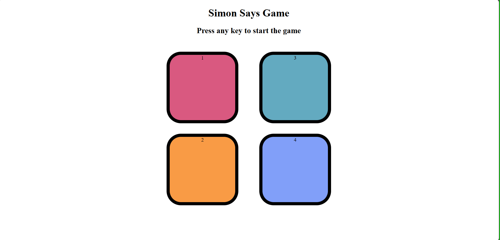

# Simon Says Game 🎮

A fun and interactive memory game built using **HTML**, **CSS**, and **JavaScript**.  
Test your memory by repeating the sequence shown by the game — each round gets harder!

## 📸 Screenshot

---

## 🔗 Live Demo
[Click here to play the game!](https://chirag6722.github.io/Simon-says-game/)

---

## 🛠️ Features
- Press any key to start the game.
- Watch and repeat the pattern shown.
- Game gets progressively harder with each round.
- Visual feedback for interactions.
- Clean and responsive UI.

---

## 📁 Technologies Used
- HTML5
- CSS3
- JavaScript 

---

